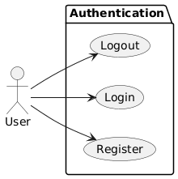
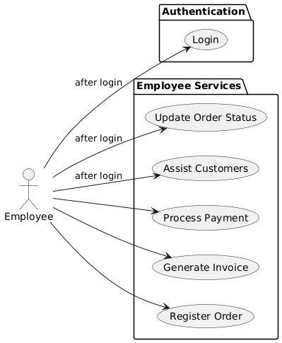
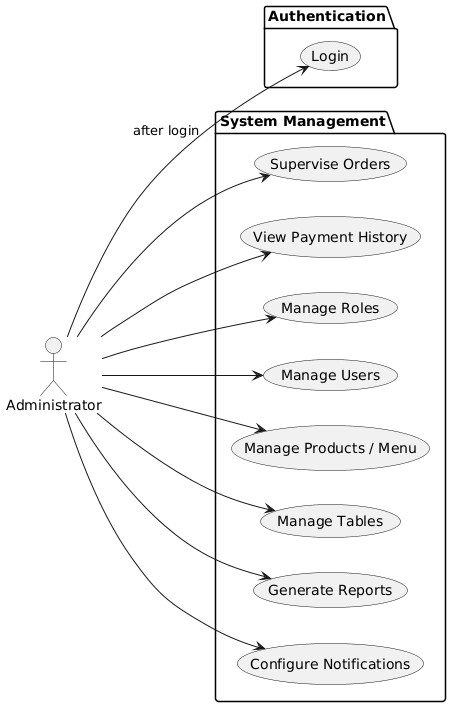
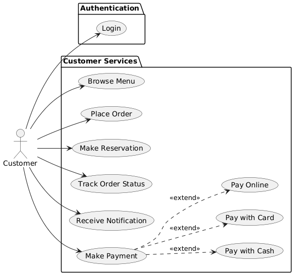

# Diagrama de Casos de Uso

Este documento presenta el diagrama de casos de uso para el **Sistema de Gestión de Pedidos del Restaurante**.

## Actores Principales

- **Cliente:** Usuario que realiza pedidos y gestiona su cuenta.
- **Empleado:** Personal del restaurante que gestiona pedidos y mesas.
- **Administrador:** Usuario con control total sobre el sistema, incluyendo productos, usuarios y configuraciones.

## Diagrama

A continuación, se muestra el diagrama de casos de uso que ilustra las interacciones entre los actores y el sistema.

### 👤 User

This diagram illustrates the general actions a user can perform within the system.

---

### 👨‍💼 Employee

This diagram shows the specific use cases available to an employee.

---

### 👑 Administrator

This diagram outlines the powerful capabilities of an administrator.

---

### 🛍️ Customer

This diagram details the interactions and processes for a customer.

---

### 🔔 Notification Service

This diagram explains how the notification service works and its interactions.
