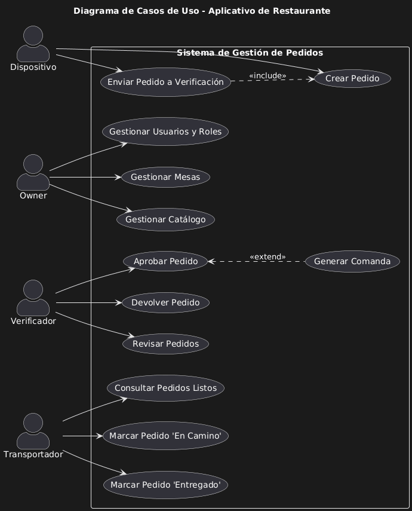
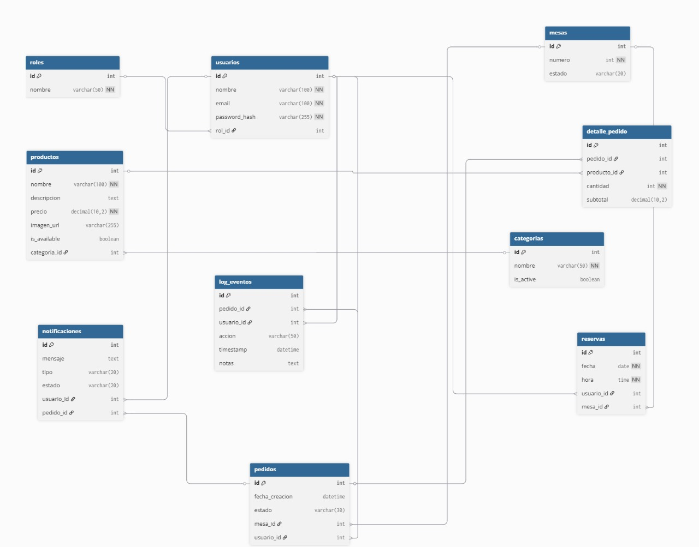

### **Entidad: Pedido (Order)**

**Definición**
Registrar y gestionar los pedidos generados desde los dispositivos en las mesas para ser procesados en la cocina y entregados por el transportador.

**Descripción**
Entidad central que representa un pedido dentro del restaurante. Es fundamental para la trazabilidad del ciclo de vida del pedido, desde que se solicita hasta que se entrega en la mesa.

**Atributos (`orders`)**
*   `id` (INT, PK, AUTO_INCREMENT)
*   `table_id` (INT, FK): ID de la mesa que realiza el pedido.
*   `device_id` (INT, FK): ID del usuario (rol Dispositivo) que registra el pedido.
*   `status` (VARCHAR(50), not null): Estado actual del pedido en el flujo. Ej: `Enviado a Verificación`, `Aprobado/En cocina`, `Listo para transportar`, `En camino`, `Entregado`.
*   `created_at` (DATETIME, not null): Timestamp de cuándo se creó el pedido.
*   `approved_at` (DATETIME): Timestamp de cuándo el verificador aprueba el pedido.
*   `delivered_at` (DATETIME): Timestamp de cuándo el transportador entrega el pedido.

**Entidad Relacionada (`order_items`)**
*   `id` (INT, PK, AUTO_INCREMENT)
*   `order_id` (INT, FK): Pedido al que pertenece el ítem.
*   `product_id` (INT, FK): Producto del catálogo solicitado.
*   `qty` (INT, not null): Cantidad del producto.
*   `unit_price` (DECIMAL(10,2), not null): Precio del producto al momento de la compra (para histórico).

**Definition of Ready (DoR)**
*   Estructura de las entidades `orders` y `order_items` definida en el modelo de datos.
*   Campos normalizados y con las validaciones correspondientes.
*   Relaciones con las tablas `tables`, `users` (Dispositivo) y `products` establecidas.

**Definition of Done (DoD)**
*   El pedido se registra en la base de datos con el estado inicial "Enviado a Verificación".
*   El detalle del pedido (productos y cantidades) se guarda en `order_items`.
*   El nuevo pedido aparece en la bandeja del rol "Verificador" para ser procesado.

### **Arquitectura**

*   **Caso de Uso:** El "Dispositivo" crea un pedido y lo envía. El "Verificador" lo aprueba. El "Transportador" lo entrega.
    *   

*   **Diagrama de Clases:** Clase `Order` con atributos y métodos para gestionar su estado (`approve()`, `deliver()`, etc.). Clase `OrderItem` para representar los productos dentro del pedido.
    *   

*   **SQL:** Entidades `orders` y `order_items` creadas en la base de datos con sus respectivas llaves foráneas y restricciones.
    *   
